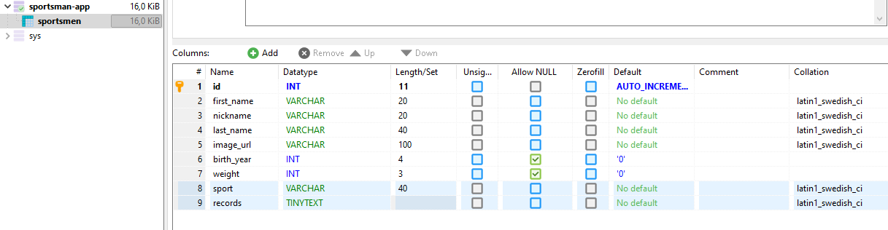

# Tietokannan asetukset

Luo HeidiSQL-sovelluksella 'sportsman-app'-niminen tietokanta ja lisää siihen 'sportsmen'-niminen SQL-table, jossa on seuraavat tiedot:

Luo tämän jälkeen käyttäjä, jolla on tarvittavat oikeudet tietokannan käyttöön ja syötä tunnukset '.env'-tiedostoon.
